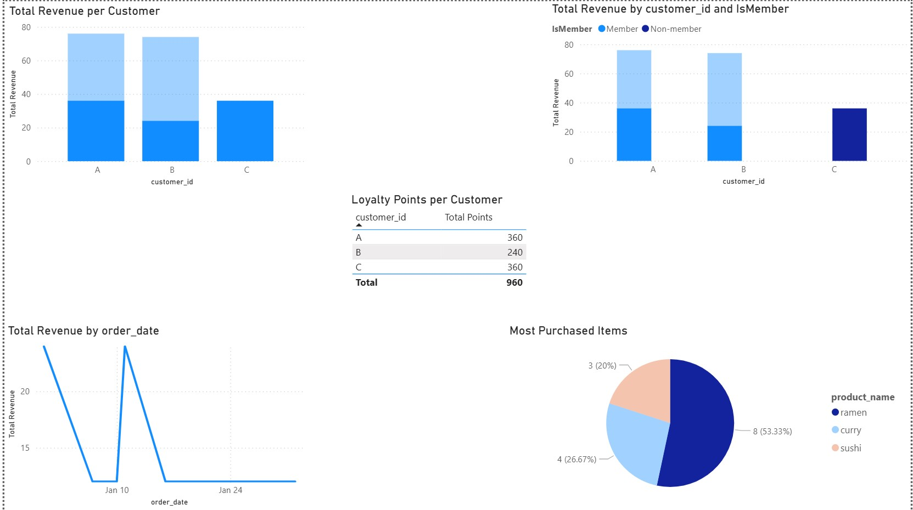

# Danny's Diner Case Study 🍜

## Overview
This project is based on the 8 Week SQL Challenge by Danny Ma.  
I recreated Danny’s Diner database, wrote SQL queries to answer 10 business questions, and visualized the results in Power BI.

## Data Model
- sales(product_id, customer_id, order_date)
- menu(product_id, product_name, price)
- members(customer_id, join_date)

## Tools Used
- SQL
- Power BI
- Git & GitHub

## Key Insights
- Total revenue by customer
- Most purchased items
- Member vs Non-member spend
- Daily sales trend
- Loyalty points summary
- 

